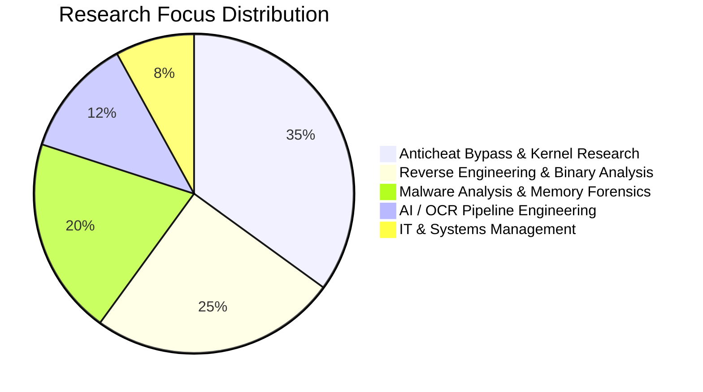
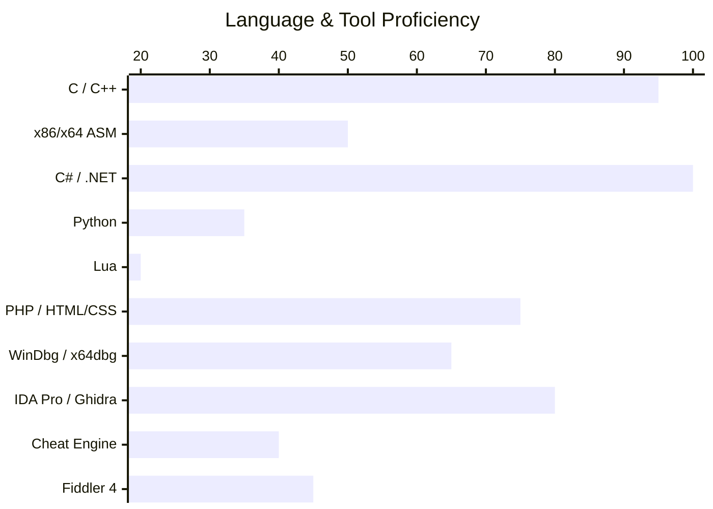

<p align="center">
  
</p>

<p align="center">
  
</p>

<p align="center">
  <a href="https://github.com/LoneEngineer99">
    
  </a>
</p>

<p align="center">
  <a href="https://github.com/LoneEngineer99?tab=followers">
    
  </a>
  &nbsp;
  <a href="https://github.com/LoneEngineer99?tab=repositories">
    
  </a>
  &nbsp;
  
  &nbsp;
  <a href="https://github.com/LoneEngineer99?tab=repositories&amp;sort=stargazers">
    
  </a>
  &nbsp;
  
  &nbsp;
  
  &nbsp;
  
</p>

<br>

---

<br>

## 🧠 About Me

```python
class LoneEngineer99:
    role        = "Manager of IT & Systems Development"
    industry    = "Electronics Manufacturing | Software Development Contracting"
    focus       = ["Anticheat Bypass Research", "Windows Kernel Security", "Reverse Engineering",
                    "Malware Analysis", "AI/OCR Integration Consulting"]
    languages   = ["C", "C++", "C#", "x86/x64 ASM", "Lua", "Python", "PHP", "HTML/CSS"]
    tools       = ["WinDbg", "x64dbg", "IDA Pro", "Ghidra", "Cheat Engine", "Fiddler 4"]
    interests   = ["Anticheat Protection Architecture", "Windows Kernel Internals",
                   "Anti-Tamper and Integrity Bypass Research",
                   "Obfuscation, Cryptography & Compile-Time Hardening",
                   "AI-Assisted Document Processing Pipelines"]
```

> 🔬 I specialize in **anticheat bypass research** — systematically studying and defeating kernel-level protection systems, integrity validators, hooks, and anti-debug mechanisms in production game clients. My research informs both offensive tooling and defensive architecture design.



<br>

---

<br>

## ⚔️ Core Expertise

<table>
<tr>
<td valign="top" width="50%">

### 🛡️ Anticheat Research & Reverse Engineering
- Kernel-level anticheat bypass research *(EAC, BattlEye)*
- Windows vulnerable driver manipulation to load and execute unsigned binaries/shellcode.
- Anti-debug, integrity check, and anti-tamper evasion
- Static and dynamic binary analysis of protected game clients and their anticheat systems.

</td>
<td valign="top" width="50%">

### 🔬 Security Engineering & Malware Analysis
- Malware static/dynamic analysis, triage, and unpacking
- Deobfuscation, code reconstruction, and signature generation
- Memory forensics and rootkit behavior analysis
- Network traffic inspection and protocol reverse engineering
- Code virtualization research
- AI/OCR pipeline design for enterprise document automation

</td>
</tr>
</table>

<br>

---

<br>

## 🤖 AI & Automation Consulting

> As an independent contractor, I bridge the gap between **OCR technology and AI-driven processing pipelines** for businesses. This includes designing end-to-end document intelligence workflows — from raw scan ingestion to structured data extraction, validation, and downstream integration — enabling organizations to automate high-volume document processing with minimal human intervention.

- Designed and deployed OCR-to-LLM extraction pipelines with user interfaces and APIs for enterprise clients
- Integrated vision models and structured output parsers for document classification
- Built automation layers that dramatically reduce manual data entry overhead
- Consulting on AI adoption strategy for manufacturing and operations workflows

<br>

---

<br>

## 🛠️ Tech Stack & Tools


<p align="center">
  
  
  
  
  
  
  
  
  
</p>
<p align="center">
  
  
  
  
  
  
  
  
</p>

<br>

---

<br>

## 📌 Featured Project

<p align="center">
  <a href="https://github.com/LoneEngineer99/zsCrypt">
    
  </a>
</p>

### 🔐 [zsCrypt](https://github.com/LoneEngineer99/zsCrypt) — Compile-Time Encryption Library
> C# wrappers providing compile-time constant obfuscation and encrypted value protection against static analysis and memory scanning. Designed to harden security tooling against reverse engineering — the same threat model encountered when researching anticheat bypass methodologies.

<br>

---

<br>

## 📊 GitHub Stats

<p align="center">
  
  &nbsp;
  
</p>

<p align="center">
  
</p>


<br>

---

<br>

## 🌐 Activity

<p align="center">
  
</p>

<br>

---

<br>

<p align="center">
  
</p>
